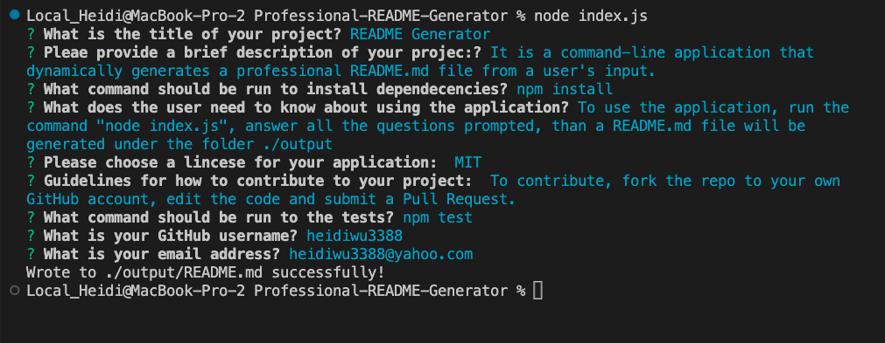
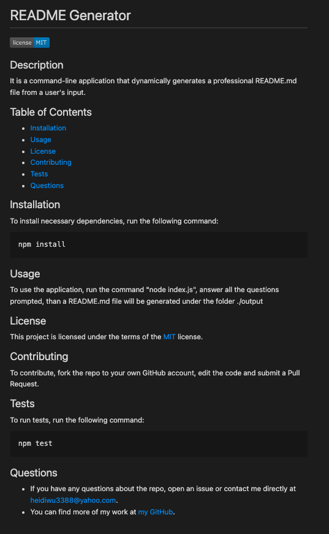

# Professional-README-Generator
Module 9 - Node.js Challenge

## Description

It is a command-line application that dynamically generates a professional README.md file from a user's input.
By using this application, project creater can quickly and easily generate a README file and this allows him/her to devote more time working on the project.

## Table of Contents
* [Installation](#installation)
* [Usage](#usage)
* [License](#license) 
* [Contributing](#contributing)
* [Tests](#tests)
* [Questions](#questions)

## Installation
To install necessary dependencies, run the following command:
```
npm install
```

## Usage
Please refer to the [video](https://youtu.be/S6pnmOXEiXM) for the details of how to use the application.
- To use the application, run the command "node index.js", answer all the questions prompted, then a README.md file will be generated under the folder ./output/
- When the user enters the project title, it is displayed as the title of the README.
- When the user enters a description, installation instruction, usage information, contributing guidelines, and test instructions, then this information is added to the sections of the README entitled Description, Installation, Usage, Contributin, and Tests.
- When the user chooses a license for the application from a list of optins, then a badge for that lincense is added near the top of the README and a notice is added to the section of the README entitled Lincese that explains which lincese the application is covered under.
- When the user enters his/her email address, then this is added to the section of the README entitled Questions, with instructions on how to reach him/her with additional questions.
- When the user clicks on the links in the Table of Contents, then he/she will be taken to the corresponding section of the README. 

## Screenshot
Sample Prompts and Answers

Sample generated README.md



## Credits
N/A

## License
None
